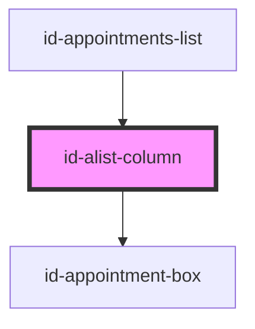

# id-alist-column

<!-- Auto Generated Below -->

## Properties

| Property           | Attribute | Description | Type     | Default     |
| ------------------ | --------- | ----------- | -------- | ----------- |
| `appointmentsList` | --        |             | `any[]`  | `undefined` |
| `name`             | --        |             | `String` | `undefined` |
| `weekDay`          | --        |             | `Date`   | `undefined` |

## Dependencies

### Used by

 - [id-appointments-list](../id-appointments-list)

### Depends on

- [id-appointment-box](../id-appointment-box)

### Graph

----------------------------------------------

*Built with [StencilJS](https://stenciljs.com/)*
