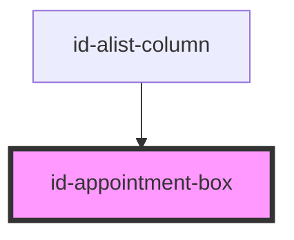

# id-appointment-box

<!-- Auto Generated Below -->

## Properties

| Property      | Attribute     | Description | Type      | Default     |
| ------------- | ------------- | ----------- | --------- | ----------- |
| `appointment` | `appointment` |             | `any`     | `undefined` |
| `update`      | `update`      |             | `boolean` | `undefined` |

## Dependencies

### Used by

 - [id-alist-column](../id-alist-column)

### Graph

----------------------------------------------

*Built with [StencilJS](https://stenciljs.com/)*
